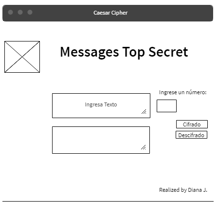
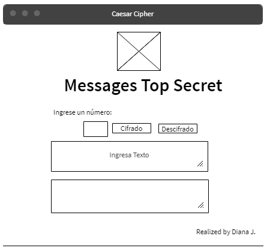

Definición del producto:
-----------------------
Messages Top Secret es una página web cuyo objetivo principal es cifrar y descifrar información con un número especifico elegido por el usuario.Asi mismo no tiene un costo por su uso.

Realizando una pequeña encuesta de boca a boca, concluí que mis principales usuarios se encuentran entre las edades de 12 a 30 años.

Los objetivos del usuario en relación al producto son: 

1.- Obtener una información encriptada y desencriptada confiable.
2.- Realizar facilmente la encriptación y desencriptación.
3.- Lograr acceder a la web desde un celular o computadora.

Cómo crees que el producto que estás creando les está resolviendo sus problemas?

Creo que el producto cumple la necesidad principal de cifrar y descifrar la información.En cuanto para mayor seguridad del cifrado seria importante que las personas se pongan deacuerdo con el offset cara a cara.

A continuación presento los bocetos del producto:

